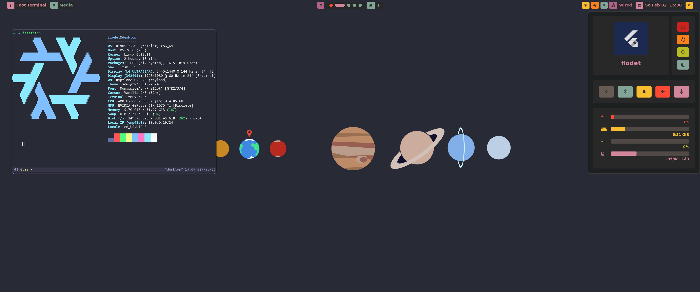

# My Nix configurations

This repository contains relevant configuration and definitions for my nix-including systems.
It is based on the experimental [flake feature](https://nixos.wiki/wiki/Flakes).

**Current state**: Under development

## Structure

```
.
├── home            | Home-Manager configuration
├── hosts           | NixOS configuration
├── modules         | Actual modules.
├── overlays        | Patches and version overrides for some packages.
├── pkgs            | Custom packages.
└── flake.nix       | Entry point and central point of configuration.
```
## NixOS

This repository contains configuration for [NixOS](https://nixos.org/).
They are stored under [./hosts](./hosts/).

Applying the configuration execute the following command:

```sh
nixos-rebuild switch --flake .#<<HOST>>
```

## Home Manager

This repository contains configuration for [home-manager](https://github.com/nix-community/home-manager).
They are stored under [./home](./home/).

Applying the configuration execute the following command:

```sh
home-manager switch --flake .#<<USER>>.<<HOST>>
```

## Development

This repository has a configuration with the necessary tooling to adjust and build the configuration.
It is configured under [./shell.nix](./shell.nix).

To start on a blank NixOS installation just run:

```sh
nix-shell
```

On an already configured system with nix, git and enabled flakes feature you can just run:

```sh
nix develop
```

After that you have all necessary tools to your disposal.
For example `sops`, `git`, `nix`, `home-manager`, or `nixfmt`.

## Secrets

This repository supports storing and providing secrets based on [SOPS](https://getsops.io/).
Integrated into nix by using [sops-nix](https://github.com/Mic92/sops-nix).

Currently the age key generated of my SSH-Key is used.

Further information about how to access and add secrets can be found in subdirectories.


## Preview

Following a picture of the current hyprland setup with `flodet@desktop` (as of (01/2025))



## TODO

- [ ] Separate config from secrets in depth
- [ ] Start using hardware token for authentication
- [ ] Add dual requirement for secrets of system and user
- [ ] Using [disko](https://github.com/nix-community/disko)
- [ ] Using [impermanence](https://github.com/nix-community/impermanence)
- [ ] Enhance ricing for more consitency and adjust for theme
- [ ] Add individual nvim config (TBD Tooling)


## Acknowledgment & References

The following resources were immensely helpful in setting up this repository:

- https://github.com/Misterio77/nix-config
- https://www.youtube.com/@vimjoyer

Also thank you to all the package maintainers, tool developer, and other resources I did not mention.
