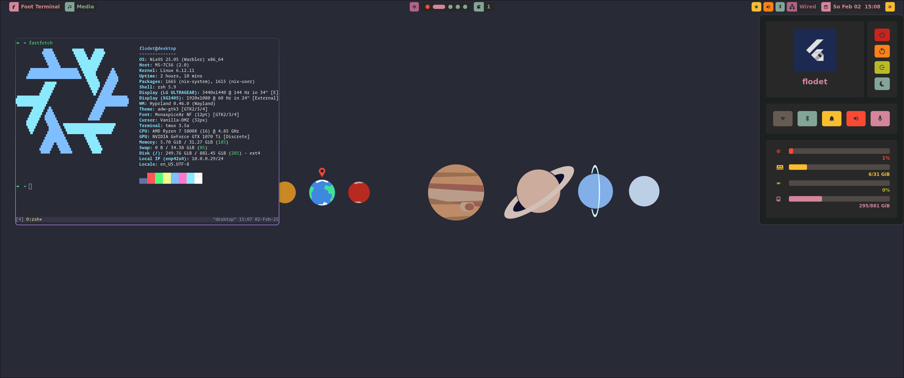

# My Nix configurations

This repository contains relevant configuration and definitions for my nix-including systems.
It is based on the experimental [flake feature](https://nixos.wiki/wiki/Flakes).

**Current state**: Under development

## Structure

```
.
├── home            | Home-Manager configuration
├── hosts           | NixOS configuration
├── modules         | Actual modules.
├── overlays        | Patches and version overrides for some packages.
├── pkgs            | Custom packages.
└── flake.nix       | Entry point and central point of configuration.
```

## NixOS

This repository contains configuration for [NixOS](https://nixos.org/).
They are stored under [./hosts](./hosts/).

Applying the configuration execute the following command:

```sh
nixos-rebuild switch --flake .#<<HOST>>
```

## Home Manager

This repository contains configuration for [home-manager](https://github.com/nix-community/home-manager).
They are stored under [./home](./home/).

The configurations are applied as a module with [NixOS](#nixos).

## Development

This repository has a configuration with the necessary tooling to adjust and build the configuration.
It is configured under [./shell.nix](./shell.nix).

To start on a blank NixOS installation just run:

```sh
nix-shell
```

On an already configured system with nix, git and enabled flakes feature you can just run:

```sh
nix develop
```

After that you have all necessary tools to your disposal.
For example `sops`, `git`, `nix`, `home-manager`, or `nixfmt`.

## Secrets

This repository supports storing and providing secrets based on [SOPS](https://getsops.io/).
Integrated into nix by using [sops-nix](https://github.com/Mic92/sops-nix).

Currently the age key generated of my SSH-Key is used.

Further information about how to access and add secrets can be found in subdirectories.

## Deployment

### USB-Stick creation

```bash
# Grab the latest minimal ISO
wget https://channels.nixos.org/nixos-unstable/latest-nixos-minimal-x86_64-linux.iso

# Make sgdisk available
nix shell nixpkgs#gptfdisk

# Wipe and partition
sudo wipefs -af /dev/sdb
sudo sgdisk -n1:0:+2G -t1:0700 -c1:"ISO" -n2:0:0 -t2:8300 -c2:"CONFIG" /dev/sdb
sudo udevadm settle

# Format
sudo mkfs.fat -F32 /dev/sdb1
sudo mkfs.ext4 -F -L CONFIG /dev/sdb2

# Write ISO
sudo dd if=/path/to/nixos-minimal.iso of=/dev/sdb1 bs=4M status=progress oflag=sync

# Copy flake
MNT=$(mktemp -d)
sudo mount /dev/sdb2 "$MNT"
sudo cp -r /etc/nixos "$MNT/nixos-config"
sudo umount "$MNT"
```

### Installation

Based on config:

```bash
# On the live ISO
mkdir /mnt/usb
mount /dev/sdb1 /mnt/usb

# Run disko
sudo nix --experimental-features "nix-command flakes" run github:nix-community/disko -- \
  --mode disko \
  --flake /mnt/usb/.nix-config#yourhostname

# Install
sudo nixos-install --flake /mnt/usb/nixos-config#yourhostname
```
Based on github:

```bash
# On the live ISO, just reference it directly
sudo nix --experimental-features "nix-command flakes" run github:nix-community/disko -- \
  --mode disko \
  --flake github:flodet/.nix-config#{yourhostname}

sudo nixos-install --flake github:flodet/.nix-config#{yourhostname}
```

### Anywhere deployment

```bash
# On your current NixOS machine
nix run github:nix-community/nixos-anywhere -- \
  --flake .#{yourhostname} \
  {root}@{targetip}
```

## Preview

Following a picture of the current hyprland setup with `flodet@desktop` (as of (01/2025))



## TODO

- [ ] Separate config from secrets in depth
- [ ] Start using hardware token for authentication
- [ ] Add dual requirement for secrets of system and user
- [ ] Using [disko](https://github.com/nix-community/disko)
- [ ] Using [impermanence](https://github.com/nix-community/impermanence)
- [ ] Enhance ricing for more consitency and adjust for theme
- [ ] Add individual nvim config (TBD Tooling)


## Acknowledgment & References

The following resources were immensely helpful in setting up this repository:

- https://github.com/Misterio77/nix-config
- https://www.youtube.com/@vimjoyer
- https://github.com/drduh/YubiKey-Guide

Also thank you to all the package maintainers, tool developer, and other resources I did not mention.
